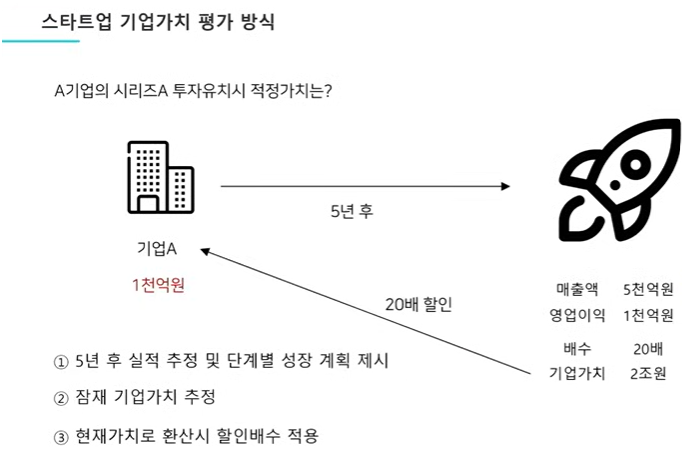
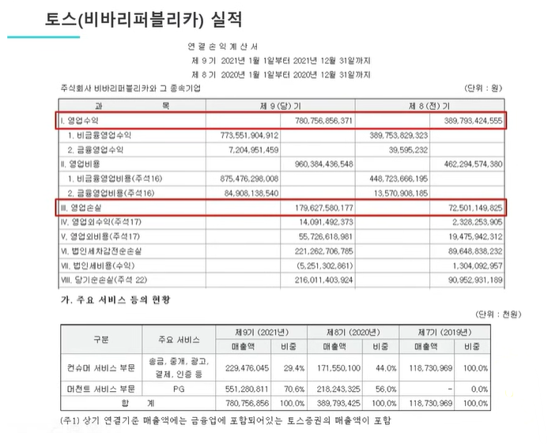
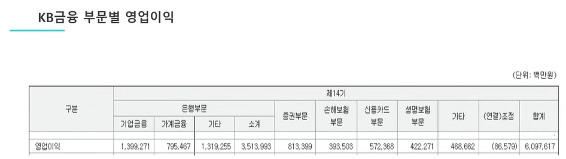
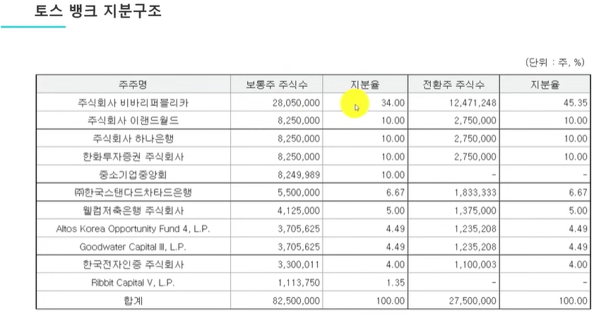
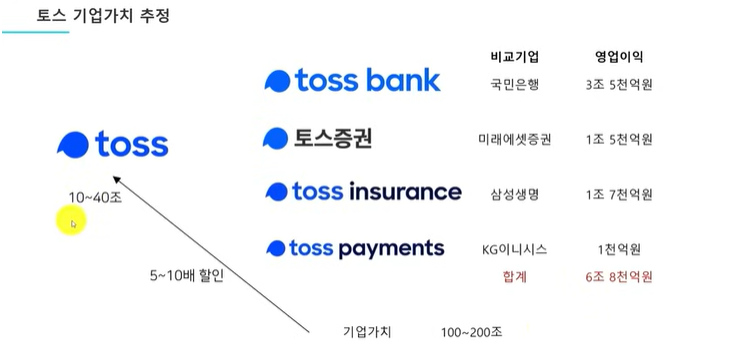
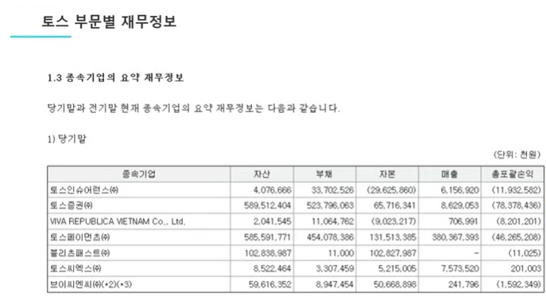
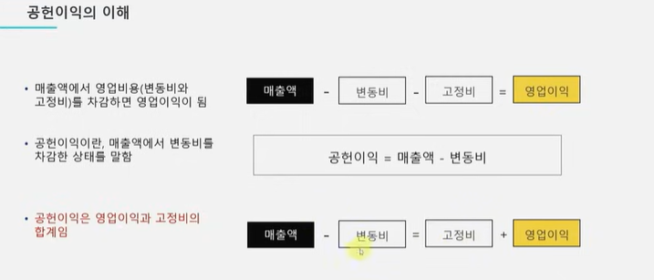
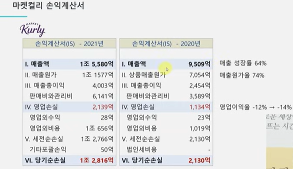
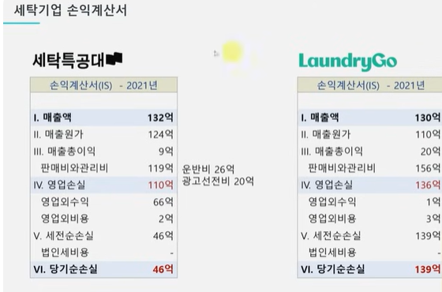

# 기업은 숫자로 보는 겁니다 
> 기업 회계 기초편, 이재용 회계사 

ref: <https://www.youtube.com/watch?v=Sc2e93i9R5A>

## 스타트업 기업가치 평가 방식

> 시리즈 A는 스타트업이 시제품이나 베타 서비스를 출시한 후, 외부 투자를 유치하는 단계. (병아리 같은 회사)

영업이익에 배수를 얹어서 기업가치 추정. 20배는 회사에 따라 다르다. 회사가 매출액이 5천억에서 평생 더 올라갈 수 없다면 배수는 5배~10배 미만, 반대로 회사가 앞으로 글로벌 진출도 해야하고 다양한 사업 다각화도 해야한다면 30배, 40배 하는 경우도 있다. 제약회사처럼 빵 터지는 기업이면 60배, 70배하는 경우도 있다. 그래서 앞으로도 성장을 할거라고 노멀하게 보면 대략 20배 정도면 합리적이다.

`-` 기업가치를 측정해야 될 때 가장 중요하게 판단해야 되는 1,2,3,4 순위?

1. 5년 후 매출액
2. 5년 후 영업이익
3. 배수
4. 할인율

이 4가지를 모두 고려해야 한다.

꼭 5년일 필요는 없지만 투자자들은 벤처캐피탈을 5년 후에 나가야 한다.

>벤처 캐피탈(venture capital, VC)이란 잠재력이 있는 벤처기업에 자금을 대고 경영과 기술 지도 등을 종합적으로 지원하여 높은 자본이득을 추구하는 금융자본을 말한다. 주로 기술력은 뛰어나지만 경영이나 영업의 노하우 등이 없는 초창기의 벤처기업을 대상으로 한다.

### 토스의 재무제표

매출액이 7,800억, 영업적자가 1,790

머천트(PG) 매출액 5,500억, 컨슈머 매출액 2,200억. 이 회사가 LG U+에서 PG사업을 사왔음.

`-` KB금융 2021년 매출액 약 59조, 영업이익 6조, 시가총액이 21조

--> 과연 토스가 이렇게 될 수 있을까?

영업이익 6종인 회사와 영업적자 1,800억 내는 회사랑 기업가치는 비등하면 어떻게 이해해야할까? 그러기 위해서는 KB금융이 어디서 돈을 버는지 살펴봐야 한다.

`-` KB금융은 어디서 돈을 이렇게 벌까?

- 은행 3조 5천억원
- 증권 8천억원
- 보험 8천억원
- 신용카드 6천억원 등

합쳐서 6조 정도 번다. 은행이 압도적!

***그런데, 토스의 재무제표를 보면 은행이 없다. --> 토스뱅크가 있는데?***

토스 뱅크의 주주구조를 살펴보자.

비바리퍼블리카가 토스, 즉 토스의 지분이 34%이다. 왜냐하면 은행을 만드려면 막대한 돈이 필요하다. 그래서 혼자서는 만들지 못하고 컨소시엄을 만들어서 들어왔는데 위의 표를 보면 기존의 금융권에서 투자자로 많이 들어왔다. 그러다보니 지분율이 34%밖에 안되고, 34%밖에 안되면 연결 손익계산서에는 매출액으로 안들어오고, '지분법 적용 투자 주식'이라는 이름으로 들어온다. (주식 한줄로 띡하고 숨어서 나온다. 그래서 숨어있다.) 그래서 은행을 또 같이 봐야한다.

그럼 결론적으로는 이 회사가 40%이상 점유율을 가져갈 것이기 때문에 사실상 토스뱅크의 지배자이긴 하다. --> 토스 뱅크의 기업가치의 40%는 토스에게 넣어줘야 한다.

KB금융이 6조 정도 벌고 신한도 그 정도 번다. 둘 다 시총이 비슷하다. 그럼 시총이 이익의 5배 정도밖에 안된다. 이익의 5배가 시총인 것은 주주들이 볼 때 이 회사는 성장 가능성이 전혀없다고 본 것과 같다. PER가 4배, 4.5배면 내가 이 회사 주식을 몽땅 사면 5년 후에는 본전을 찾을 수 있을 거라는 말인데, 이말은 즉슨 이 회사는 절대 앞으로 6조 이상을 벌지 못할 거라고 시장이 평가한 것이나 다름없다. 내리막길 밖에 없다. (PER가 5이하인 주식은 별로 잘 없다. 저평가 되어있거나 미래가 어둡다고 보거나)

`-` 토스는 기업가치를 어떻게 평가할까?

이 재무제표는 솔직히 말해 볼게 없다. 왜냐하면 기존 은행이 은행 증권, 보험에서 돈을 벌어야 하는데 토스 매출액을 보면 은행은 거의 없고, 증권도 거의 없고, 보험/신용카드는 아예 없다.

근데 왜 기업가치가 20조일까?

## 공헌이익

공헌이익과 고정비가 싸워서 공헌이익이 이겼다? --> 회사는 영업이익이 난다.

사업이라는 것은 결국 공헌이익과 고정비를 싸움붙이는 것. (고정비는 숨만 쉬어도 나가는 비용..)

경영자 입장에서 이익이 나려면 공헌이익을 늘리거나 고정비를 줄여야 한다. 공헌이익을 늘리려면 2가지 방법이 있는데, 매출을 늘리거나 매출 하나 당 들어가는 재료비, 포장비 등을 줄이는 것인데 스타트업 중에는 공헌이익이 안나는 회사들이 많다. 즉, 하나를 팔았는데 매출액보다 변동비가 더 크다는 의미이다. (원가, 포장비, 배달비, 판매수수료 등을 다 합친)

공헌이익이 안나는 회사는 평생 영업이익이 안난다.

##  스타트업 중 이익이 안나오는 회사들의 문제

보통 두가지 케이스 중 하나인 경우가 많다.

- Case1: 공헌이익이 안나오는 경우.
- Case2: 고객 수(트래픽)은 많이 모았는데 매출액이 안나오는 기업.

실제로 이런 문제를 겪고있는 회사들의 재무제표를 보면서 정보 이용자, 잠재적 투자자로서 재무제표를 볼 때 저 회사가 공헌이익이 나는 회사인지? 아닌지? 매출액이 적정한 회사인지 그렇지 않은지 보려면 어떤 포인트를 봐야하는지 사례를 살펴보자.

### 사례1: 마켓컬리 손익계산서

### 사례2: 세탁기업 손익계산서

기본적으로 매출 원가율이 굉장히 높다. 매출원가가 높다는 말은 세탁물을 받아 세탁 공장을 돌리는데 들어가는 원가가 적지않고, 개별 집집마다 픽업해야 하는데 운반비/인건비 등이 생각보다 되게 높다.  

`*` 이 구조에서 이 회사가 이익을 보려면?

지금 하고있는 매출에서 단가를 2배 높여야 한다. 그래야 손익분기점이 된다.

>커머스 같은 개개인의 노동력으로 서비스하는 기업들은 변동비율이 높을 수밖에 없다. 성장하기는 좋다.(저렴하니까)  공헌이익이 나오기는 쉽지 않은 비지니스다. 결국 1인당 파는 객단가를 확 늘리는 방법을 강구하지 않으면 정말 쉽지않다. (마켓컬리가 화장품을 파는 이유도 이런 이유, 화장품은 원가가 낮으니까)