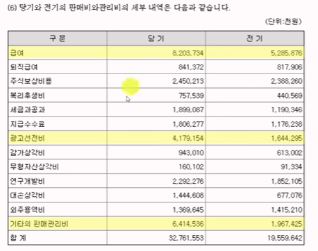

# 50대가 된 헬로키티 돈을 끌어 모으는 이유
> 파인드 어스 이재용 회계사

ref: <https://www.youtube.com/watch?v=0Sk5b4P-iTU&list=PL142diDwvogb966KeF66VWUI3Am_MghM-&index=2>

## 티니핑 개요

`-` 시즌1에 나오는 캐치 티니핑

> ref: [**SAMG 엔터주가 확인하기(네이버페이증권)**](https://finance.naver.com/item/main.naver?code=419530)

파산핑이라고 불릴 정도로 잘 나가는 캐릭터인데 주가가 왜이럴까? 심지어 적자다.

수많은 부모님들을 파산시켰는데 정작 회사는 왜 적자일까? 

### SAMG엔터 포괄손익

21년 33억 정도 이익이었다가 적자전환을 살짝했지만, 22년 12월 코스닥 시장에 상장을 하면서 사람들은 일시적 적자일거라고 생각하고 투자를 했다. 그런데 1년이 지난 후 적자가 94억으로 늘어났다. 도대체 뭐가 문제일까?

### 적자의 원인

`1` 매출원가율이 무려 75%! 캐릭터 산업인데 원가가 왜 이렇게 많지? 매출원가율이 75%이면 일반적인 제품보다도 높은 것이다. 거의 반복적으로 찍어내는 엄청난 대량 생산한 제조업에서 75%이면 오케이인데, 이 경우는 대량 생산이 아니라 다품종 소량 생산을 하는 장난감 비즈니스이다. 그럼 이렇게 원가율이 높으면 안된다.

`2` 매출액 대비 판관비가 매우 빠르게 늘어난다.

직원들 인건비, 관리비 등을 쓰는데 29%, 34% 쓴다는 것. 기본적으로 원가가 빡빡한데 보통 원가가 빡빡한 기업은 판관비를 조금 쓴다. 그거라고 줄이기 위해서..

원래 매출이 늘어나면 원가율이 내려가야 정상이다. 근데 매출이 늘어나면서 원가율이 안내려갔다. 그러면서 판관비까지 같이 늘어난다. 그래서 영업적자가 -10%까지 나왔다?

***그럼 도대체 원가율이 왜 높은걸까?***

### 매출과 매출원가

한국에서의 매출액이 774억 정도로 해외매출(176억)보다 많다.

비중으로 따져보면 이제 완구나 패션 잡화 매출이 780억 그리고 컨텐츠가 33억, 라이선스가 110, 용역(티니핑 테마월드)이 23억으로 결국 전체적으로 매출 비중은 완구 및 패션잡화가 압도적이다. 우리를 파산시킨 완구가 780억 나머지는 그렇게 많이 늘어나지 않았다.

***그럼 완구를 많이 팔아서 적자가 커졌다?***

그럼 제품의 매출 원가가 몇 퍼센트인지 찾아봐야 한다.

### 부문별 매출총이익

> 각 품목별로 원가율이 어느정도 될까?

상품이나 제품은 26% 남는다. (얼마 안남는다) 그리고 컨텐츠 제작은 무조건 적자이다. 애니메이션은 사람 손으로 가야하는데 단가를 인정받기가 좀 어렵다. 주로 이제 OTT나 방송사에 팔텐데 애니메이션은 단가를 많이 받기가 어렵다. 그렇다 보니 무조건 적자이다.

그럼 컨텐츠 사업을 왜 하느냐? --> 상품 매출이 있으니까 팔려고!

컨텐츠 제작에서 20억 적자를 깔고가는데 제품 매출에서 나오는 매출 총이익이 26% 밖에 안된다. 그럼 다시 돌아와서 왜 이렇게 매출 원가율이 높고 매출 총이익이 낮을까?

>모든 문제는 상품이랑 제품 원가율이 왜 이렇게 높냐는 것.

--> 생각해보면, ***매출 단가랑 매입 원가 둘 다 문제가 있지 않을까?***

즉, 매출 단가를 너무 싸게 팔았거나 매입 원가를 너무 비싸게 사왔거나. 혹은 둘 다?

매출 단가는 회사 입장에서 매출 단가와 고객이 사는 매출 단가가 다르다. 왜냐하면 중간 유통 단계를 거쳐야 하기 때문이다. 

### `1` 첫번째 문제: 높은 매출 원가율

#### 주요매출처

위의 표에는 사업보고서의 주요 매출 채널이 나오는데 제품 같은 경우 22년까지 삼진인터내셔널에 대한 매출이 되게 높다.

SAMG 엔터는 장난감을 파는 유통회사가 별도로 있다.  SAMG엔터는 애니메이션은 잘 만드는데 완구는 만들어 본 적이 없다. 그래서 이마트나 홈플러스 같은 대기업에 어필하기 되게 어렵다. 

완구 만드는 영역이나 애니메이션 만드는 영역 즉, 제조업과 컨텐츠 업은 완전 다르다. SAMG 입장에서는 누구한테 만들어 달라고 해야하는데 그래서 이제 만들어 본 사람이랑 컨택을 한 것이다. 그게 바로 '삼진인터내셔널'이다.(유통도 해주고, 제작 노하우도 있고 아는 공장도 있으니까 만드는 것도 도와줄게)  

SAMG엔터는 이제 같이 만들어보고 그 대신 너를 통해 유통을 할게라고 하고 이제 시작을 한 것이다. (SAMG엔터가 아쉬운 입장)

티니핑이 터지고나니까 SAMG엔터가 매출액 467억(전기 대비 85% 상승)에 영업이익 132억(전기 대비 215% 상승)을 찍었다. 

이 때는 SAMG는 적자였지만 유통사가 영업이익을 100억을 넘게 벌은 것이다.

아쉬운게 삼진엔터(나는 캐릭터는 있는데 만들 줄을 모른다.)이기 때문에 애초에 계약할 때 조금 불리하게 즉, 단가를 낮게 계약을 한 것이다.

즉, 삼진인터내셔널은 중간유통사. 이마트나 홈플러스 가기 전에 중간 유통사가 있고, 중간 유통사에 그 장난감을 팔아야 하는데 그 단가가 낮은 것이다.

***=> 가격에 문제가 있으니까 원가율이 75%가 나오는 것이다.***

그래서 SAMG엔터도 삼진인터내셔널의 의존도를 낮춰야겠다 해서 실제로 23년에 매출액이 확 줄어든다. 22년 287억에서 23년 96억으로 줄어들었다. (아래 표 참고)

23년도부터는 SAMG엔터가 깨달음을 얻었다. 

>저기 다 퍼주니까 우리가 남는게 없네 이제 내가 직접 유통해야겠다.
-> 내가 직접 이마트 담당자, 홈플러스 담당자한테 전화하고 내가 직접 공장에 전화해서 그렇게 만들어야겠다

***이제 직접! (조직을 갖춰 나감)***

직거래를 했음에도 불구하고 23년 원가율은 그렇게 낮아지지 않은 것으로 보아 아직까지는 성공적이지는 않은것 같다.

### `2` 두번째 문제: 매출액 대비 빠르게 증가하는 판관비

***문제는 직거래 구조로 가다보니 판관비가 늘었다.***

삼진인터내셔널이 원래 하던 것(전화도 하고, 돈도 받아주고, 전국 각지로 뿌리는 물류 등등)을 직접하다 보니, 

- 급여도 52억 -> 82억으로 (영업도 하고 관리도 해야 하니까),
- 기타의 판매관리비(물류로 추정)도 19억->64억으로 상당히 많이 들었다.

`-` 23년도 SAMG엔터의 판관비 세부내역

이제 삼진이 하던걸 직접 해야하는데에도 불구하고 매출 단가는 아직 제대로 인정을 못받았다. 그러다 보니 ***마진은 아직 안올랐는데 운영비만 확 오른것이다.*** 

=> 그래서 23년 적자 규모가 커졌다.

그렇게 해서 매출 단가 이슈를 어느정도 유추해 볼 수 있었다. 이제 매입에 대한 이슈를 살펴보자.

#### 주요 매입처

원재료 매입처를 보면 여러 회사 있는데 중국이 비중이 제일 크다. 당연히 자사의 어떤 공장이나 설비는 하나도 없고, 외주로 생산한다. 애니메이션 제작 회사니까 외주로 하는데 이 회사의 특징이 제품 종류가 엄청나게 많다는 것이다. (티니핑 1,2,3,4 시즌 다 합쳐서 무려 100마리가 나왔다.) 티니핑 100마리당 학용품, 인형, 학용품, 등등하면 제품이 가지 수만 몇 백가지 몇천가지가 나오는데 아직 제품 볼륨이 몇 천억 할 정도의 볼륨은 아니다.

구매자 입장에서는 공장한테 MOQ(최소 발주량)를 많이 넣어줘야 공장 입장에서 그럼 내가 싸게 해줄게라고 하는데 아직 규모도 작고 돈도 많이 없고 제품은 몇백, 몇천 가지나 되니 공장한테 끌려갈 수밖에 없다.

이렇게 엄청난 다품종 소량 생산이다 보니 매입 단가를 싸게 할 수가 없다. 매입 단가를 싸게 하려면 무조건 한가지 제품을 많이 찍는 게 최고인데 정 반대니까 매입 단가를 높일 수밖에 없다.

--> 그럼 이제 **(1)price도 직유통을 못해서 싸고**, **(2)매입 단가도 초다품종 소량 생산이라 높고** 그러니까 매출원가로 75%가 나오는건 위아래 둘 다의 문제일 것이다.

결국 이 회사 입장에서 숙제는 

1. 유통도 되게 잘 해야되고 (전국에 있는 할인마트에 컨택)

2. 제조에 대한 노하우도 갖춰야 하고,

3. 상품도 될만한 것을 추려서 많이 찍어 내야한다.

애초에 제조 노하우 + 세일즈 노하우를 갖춰야 하는데 태생이 애니메이션 제작회사

이렇게 캐릭터 비즈니스가 어렵다..