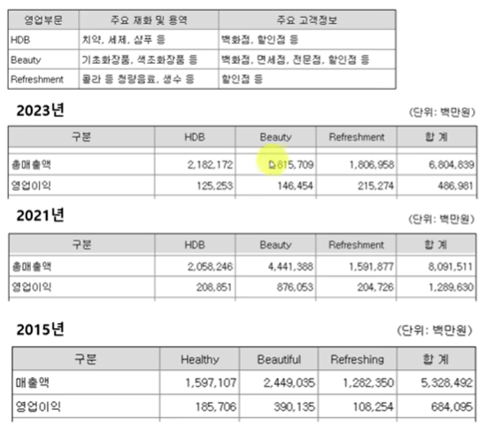
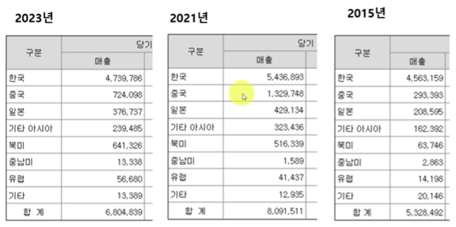
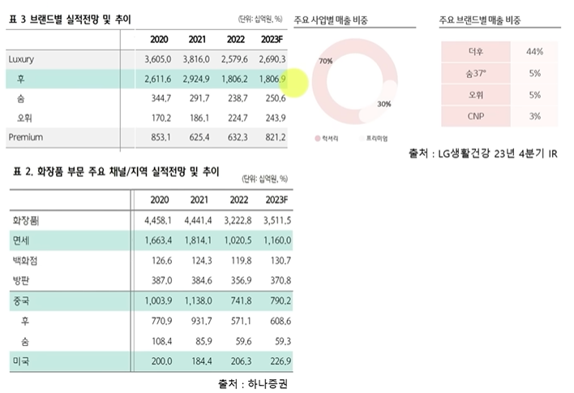

# 한국 화장품 회사들 재무제표를 까봤습니다

> 파인드 어스 이재용 회계사

ref: <https://www.youtube.com/watch?v=tKRFTCVEIHw&list=PL142diDwvogb966KeF66VWUI3Am_MghM-&index=5>

## LG생활건강과 아모레퍼시픽의 주가 및 실적

## LG생활건강 2023년 손익

매출액이 생각보다 많이 안떨어졌는데? 일반적인 제조업인 것을 감안하면 매출원가율도 그렇게 높은 것은 아니다.

## LG생활건강 부문별 실적

HDB와 Refreshment는 거의 고정이다. (콜라 안먹을거야? 먹어야지, 양치 안할거야? 해야지)

***그런데 왜 주가가 왜 그 모양이야?***

15년에서 21년으로 가면서 매출액과 영업이익 모두 거의 2배 가까이 늘었다가 최근에 와서 떠오르기 전보다 낮아졌다.

$\to$ LG생활건강이 주가가 오르내리는 것은 어짜피 콜라랑 치약은 항상 있을거니까 결국 가운데에 있는 Beauty가 올라가면 주가가 올라가고, Beauty가 내려가면 주가도 내려가겠구나! 

$\to$ 결국 이 회사는 Beauty만 보면 되는 것이다. (실제 IR자료를 살펴보면 다른 얘기는 없고 화장품 얘기만 가득하다.)

`-` 그럼 화장품 매출이 왜 줄어들었을까?

> LG생활건강 지역별 매출을 살펴보자.

중국이 떠오르면 $\to$ Beauty가 떠오르고 $\to$ 그럼 영업이익이 많이나와 $\to$ 주가 상승

중국이 떨어지면 $\to$ Beauty가 떨어지고 $\to$ 그럼 영업이익이 떨어져 $\to$  주가 하락

한국의 매출 중에서도 1조~2조 정도는 면세점 매출이다.

> 그럼 우린 중국 외에는 뭐하지?
>
> $\to$ 북미 사업 관련한 인수를 많이 하는데 그것이 적자인 것이다. 매출액은 옜날보다 늘었지만 적자.(무형자산손상차손)

그럼 도대체 뭐가 문제인지 LG생활건강 23년 4분기 IR자료를 살펴보자.

`-` 브랜드별/채널별 매출비중

화장품에는 럭셔리와 프리미엄이 있다. 오른쪽 주요 사업별 매출 비중을 보면 럭셔리가 70%, 프리미엄이 30%를 차지한다. (럭셔리가 비싼 것 프리미엄이 덜 비싼 것.)

그 와중에 '더후'라는 브랜드가 44%로 절반 가까운 매출을 기록하고 있다. 잘 나갈때는 더후 매출이 약 3조원까지 찍었다가 23년에는 많이 빠졌다. (2023F forecasting이라 실제로는 더 많이 빠졌을 것.) $\to$ 빠진 것은 다 '더후'가 빠진 것.

> '더후' 원툴 기업?

표2를 보면 이 회사의 매출채널이 면세, 백화점, 방문판매로도 많이 팔지만 LG생활건강에서 집중했던 것 중 하나가 '면세'이다. 면세에서만 1조 8천억을 파는데 23년에는 1조 내지는 더 빠졌을 것.

더후가 망가지면서 $\to$ 면세가 박살   

결국 LG생활건강이 주가가 올라갔던 이유는 요약해보면 '더후'라는 브랜드를 중국 현지와 면세점에서 싹 쓸었었는데 중국 현지에서도 안팔리고, 면세점에서도 안팔린다.

사실, 럭셔리 브랜드를 면세점에서 파는 것도 이상하다. 고급 브랜드라서 좋긴 한데 면세점에서 따이공(중국 보따리상)이 쓸어가면 현지에서는 얼마에 파는지는 회사가 컨트롤할 수 있는 부분이 아니다.

(따이공들은 자기가 쓰려고 가져가는게 아니라 보통 되팔이하려고 가는 것이니까)

20만원에 사갔는데 만약 잘 안팔려? 그럼 10만원에 팔아도 본사가 컨트롤할 수 없는 영역이다. 재고 처리는 해야하니까. $\to$ 본사입장에서는 럭셔리 브랜드인데 브랜드 이미지가 망가진다.

길게보면 따이공들을 후원해주고 우대해주면 안됐었던 것이다.

